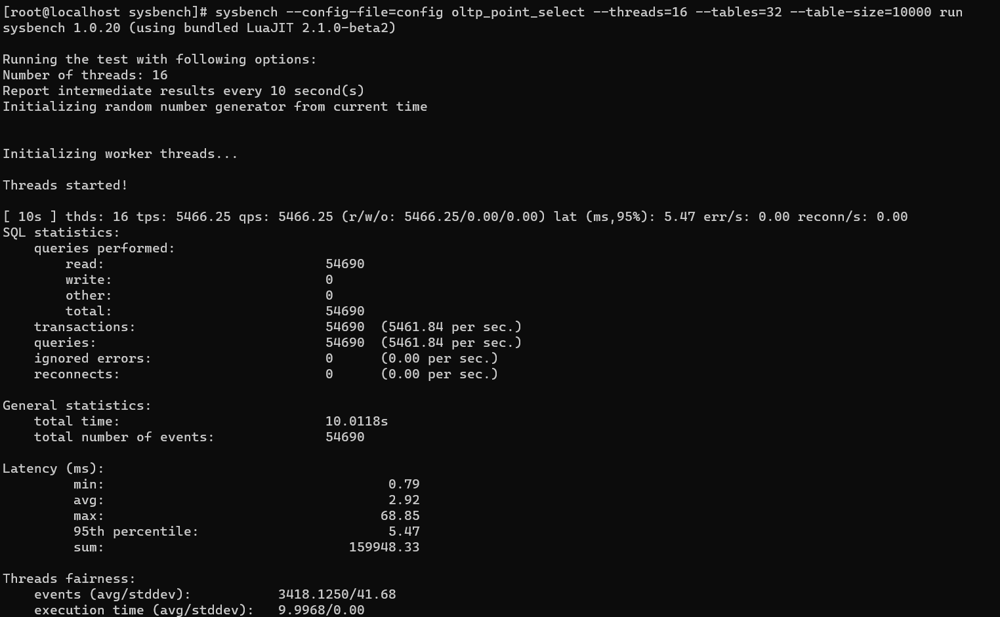
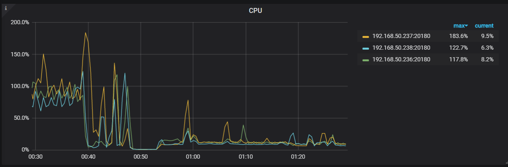

# TIDB 性能测试

## 作业内容

## topu环境

## 机器配置

> 类型: 虚拟机实例 X 5台
>
> CPU: i5-10400 / 2C
>
> 内存: 4GB
>
> 磁盘: 型号:SN750 SSD 大小: 30GB

### 部署首次性能测试

## sysbench

#### 导入命令

> sysbench oltp_update_non_index --config-file=config --threads=32 --tables=32 --table_size=10000 prepare

#### 性能测试

##### oldp_point_select

##### oldp_update_index

##### oldp_read_only

##### TIDB监控截图

##### TIKV监控截图

### GO-YCSB

#### workloada

#### workloadb

#### workloadc

#### TIDB 监控

#### TIKV监控

### GO-TPC

#### tpcc

> go-tpc tpcc -H192.168.50.234 -P4000 -D tpcc --warehouses 8 prepare -T 8
>
> go-tpc tpcc -H192.168.50.234 -P4000 -D tpcc --warehouses 8 run -T 8
>
> go-tpc tpcc -H192.168.50.234 -P4000 -D tpcc --warehouses 8 check -T 8
>
> go-tpc tpcc -H192.168.50.234 -P4000 -D tpcc --warehouses 8 cleanup -T 8

#### TIDB监控

#### TIKV监控

#### tpch

>  go-tpc tpch prepare -H 192.168.50.234 -P 4000 -D tpch --sf 4
>
>  go-tpc tpch run -H 192.168.50.234 -P 4000 -D tpch --sf 4

#### 性能分析

> sql解析模块耗时较高， 从多种工具压测时的负载监控来看，当前集群在tidb节点及tikv节点的CPU 上存在瓶颈。所有节点均为2C4G配置，负载上升时tikv节点CPU率先被打满。可通过调整tikv节点及tidb节点CPU资源，进一步观测压测结果验证，受限于本地宿主机CPU核数，暂无法调整CPU 资源验证猜测。 
>
> 集群目前tidb计算节点只有1个，在运行tpch sql压测过程中出现过tidb进程崩溃的无响应的情况，自动重启恢复， 详细原因暂未分析，可能TPCH压测对tidb压力较大。
